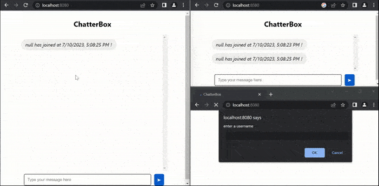

## ChatterBox
<!-- Project Description-->
Chatter Box is an engaging project that allows you to explore the world of WebSockets while building a dynamic chatroom application. By leveraging the ws package for WebSocket server development and the browser-native WebSocket API for WebSocket client development, you will unlock the power of real-time communication.

<!-- Image GIF of Project -->


### Requirements
Need to have Node.js on terminal to run the projects. 
To check if you have Node.js and npm installed, type these in your terminal:
```bash
npm -v
node -v
```
Follow this link if you have not installed Node.js: [Install Node.js](https://nodejs.org/en)

The projects run on the ES6 version of JavaScript and require fairly recent web browser versions to run the web applications.

### Usage
<!-- Usage instructions -->
1. To use the projects, you need to either *clone the repo* or *download zip* of the repo. Then, go to the appropriate folder to check out the project:
```bash
git clone https://github.com/sreeharsha-rav/javascript_projects.git
``` 

2. To run this application, first open up a terminal. Then, run the command below:
```bash
npm install
node server.js
```

3. Open your local browers and type in ```localhost:8080``` to join ChatterBox.

4. If you need to restart the server, press ```ctrl + c``` to stop the server and enter ```node server.js``` again. Then, refresh browser to restart client session.

### Credits
<!-- Credits and References -->

Tutorials, materials referenced from Codecademy:
- [Learn WebSockets](https://www.codecademy.com/learn/learn-websockets)
